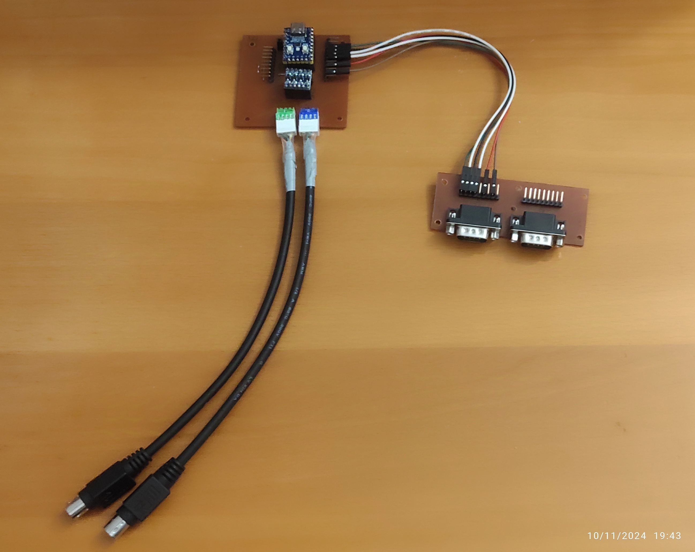
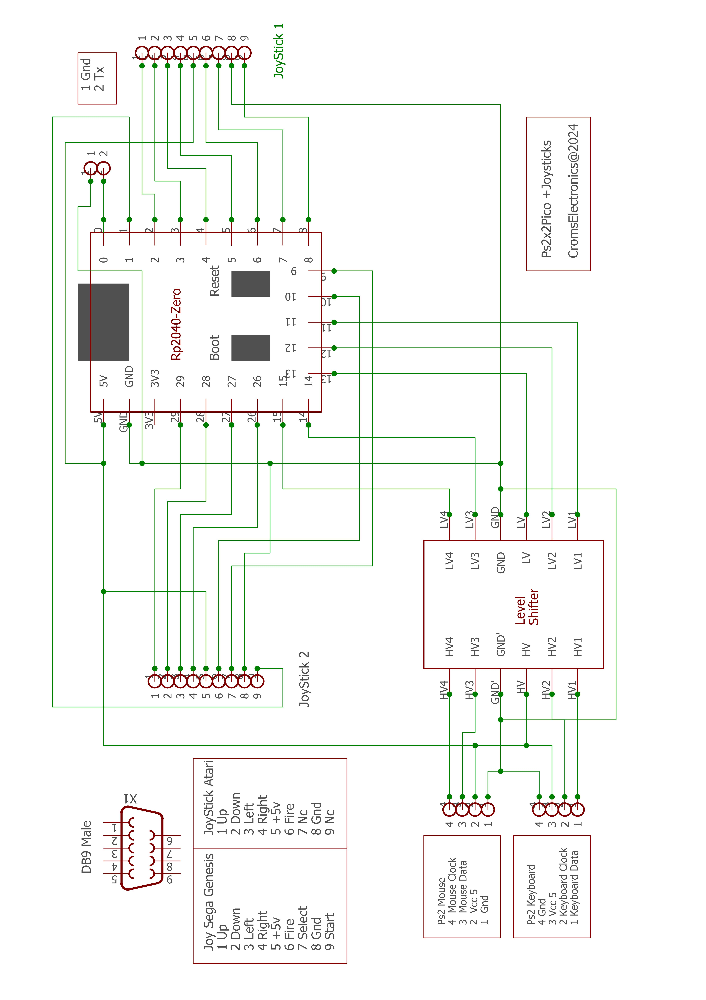
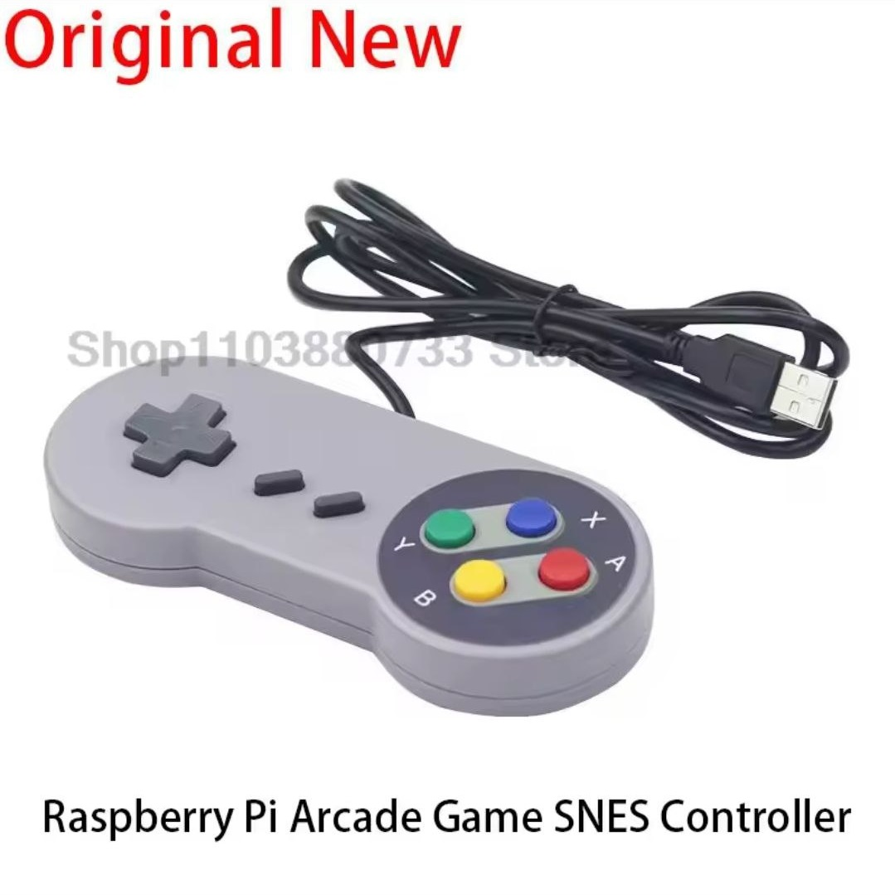

# PS2x2Pico&Joystick's

**forked from  https://github.com/No0ne/ps2x2pico, https://github.com/destroyer-dcf/usb2ps2**

USB keyboard/mouse to PS/2 interface converter using a Raspberry Pi Pico by No0ne

He diseñado una placa nueva inspirada en la placa con Rp2040 Zero de **Destroyer** ( **https://github.com/destroyer-dcf/usb2ps2** ),

Cuando la vi pense que lastima no aprovechar los pines que sobran.... y este es el resultado esta en fase beta, pero en principio es funcional,  el soporte para gamepad usb y los 2 puertos DB9 norma Atari es operativo mapaeado con los Ps2 Key ESpecial codes para usar con emulador ESPectrum, en resumen:

 - El gamepad USB se corresponde al joystick 1 en emulador ESPectrum.
 - El DB9 1 al joystick 1 en emulador ESPectrum.
 - El DB92 al joystick 2 en emulador ESPectrum.

Pendiente dar soporte para gamepad de sega de tres y seis botones al igual que el proyecto de  **David Carrion** (  **https://github.com/dacarsoft/DB9_2_Keyboard** ) o el fork del mismo de **Antonio Taimaron**, PowaJoy ( **https://github.com/hash6iron/PowaJoy**),

Añadido soporte para GamePad USB imitacion  Nintendo Snes

### **Mapeando los botones con los especial ps2 Keycodes para su uso en emulador ESPectrum**

En la carpeta PCB se pueden encontrar los pdf generados con eagle para quien quiera hacerse la placa, yo uso papel de transfer para circuitos, los imprimo con la impresora laser y seguidamente los plancho literalmente con la plancha de casa para transferirlo a la placa, depues agujeros, y a continuacion atacado del cobre con un baño de 3 partes de salfuman y 2 de agua oxigenada, y una vez eliminado el cobre sobrante limpieza con acetona para quitar el toner,   pintar con colofonia (resina de pino) para proteger las pista y facilitar su soldado y ya finalmente soldar los componente.

Para compilar, en pricipio instalar en vscode la extensión oficial Raspberry Pi Pico`v0.17.1`y seguir las instrucciones que se pueden encontar en la pagina de https://github.com/No0ne/ps2x2pico.

Copiar el fichero  .uf2 situado en el directorio release en la raiz del Rp2040 Zero, pulsar boton boot y conectar al usb.

**LeoCroms@2025**
