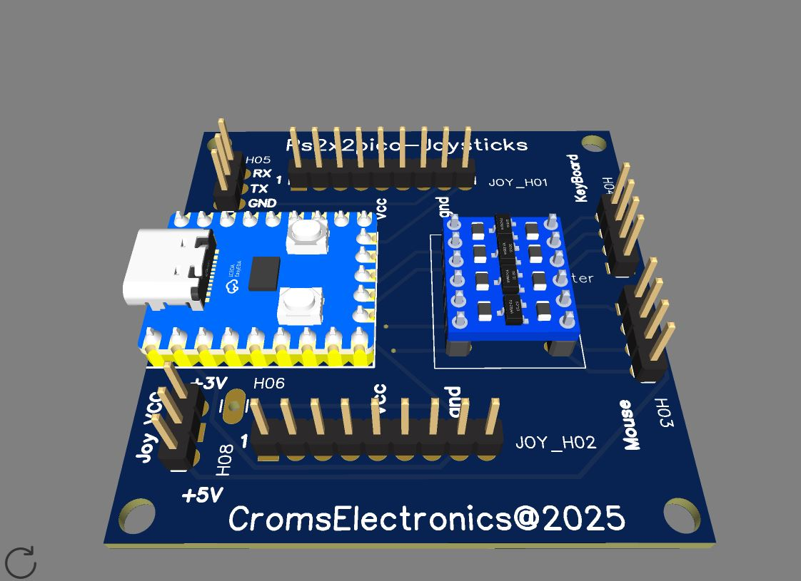
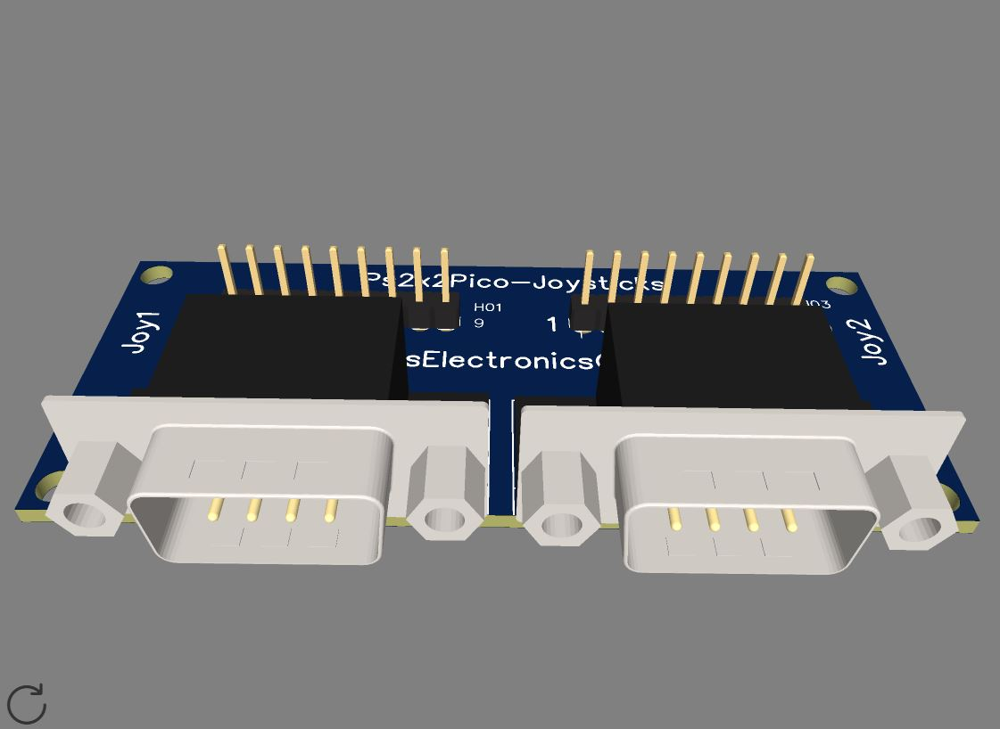
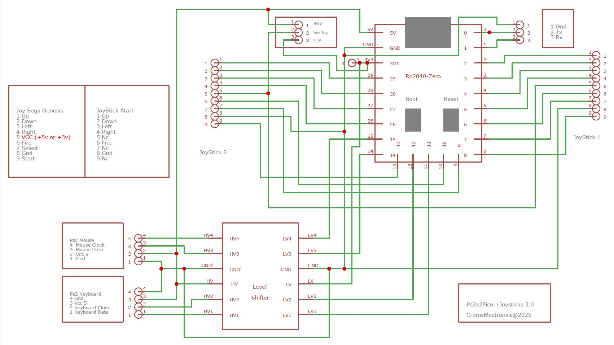
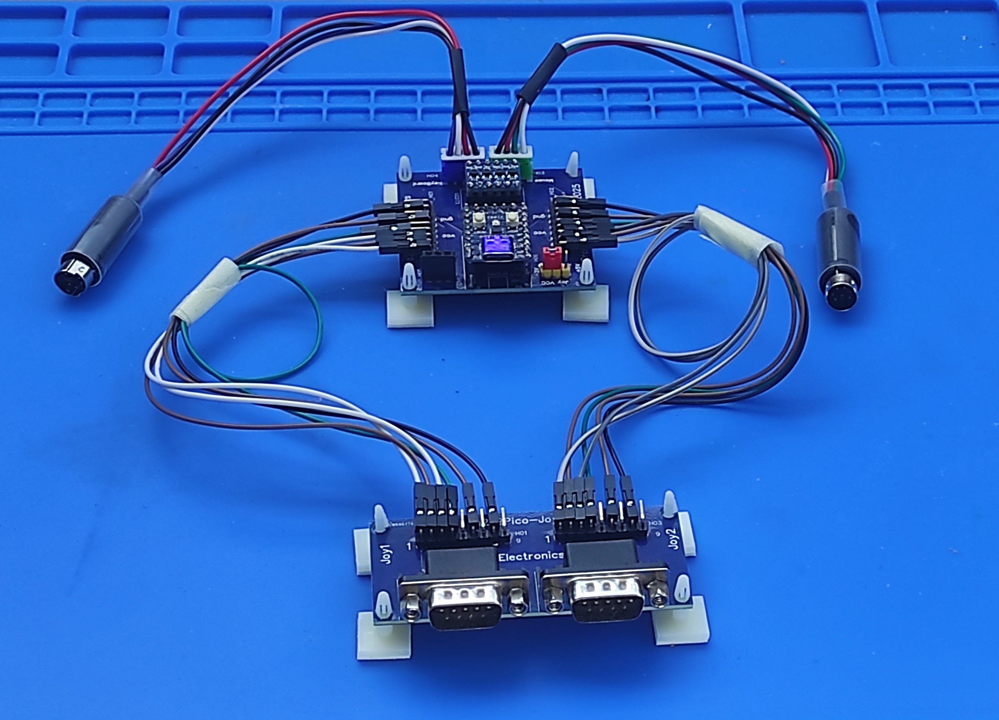
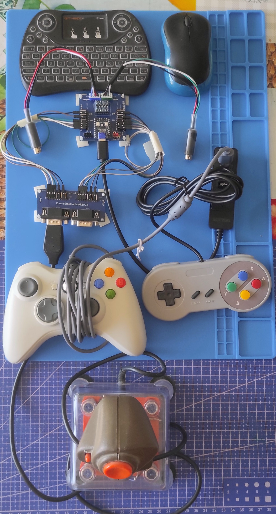
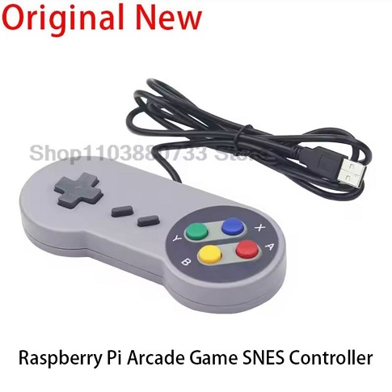
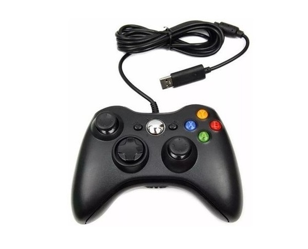
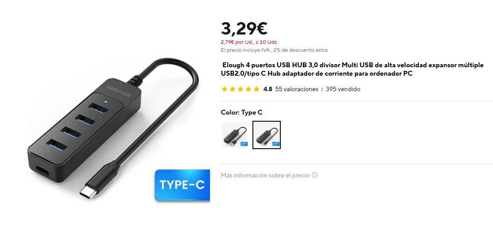

# Nueva PCB 2.0 CROMS_PCB

Se proporcionan enlaces para encargar su fabricación, la alimentacion de 3 voltios ahora sale directamente del pin de 3 voltios del microcontrolador, liberando el GPIO 13, que en la antigua placa era usado como GPIO  vcc de 3 voltios, el GPIO 13 ahora es usado por la patilla 9 de joy 2, liberando el GPIO 01 correspondiente al pin RX de la uart del pico.
Pobilidad de elegir la alimetacion del joystick entre 3 voltios y  5 voltios haciendo uso del puente joy Vcc, para futuro soporte de joystick Sega, en la medida de los posible sera preferible usar el modo de 3 voltios, en caso contrario sera necesario hacer algun tipo de adaptacion puesto que el micontrolador no soporta el uso de 5 voltios en sus GPIO, y podriamos  **Dañarlo**

# PS2x2Pico-Joysticks

**forked from  https://github.com/No0ne/ps2x2pico, https://github.com/destroyer-dcf/usb2ps2, https://github.com/Ryzee119/tusb_xinput**

USB keyboard/mouse to PS/2 interface converter using a Raspberry Pi Pico by No0ne

He diseñado una placa nueva inspirada en la placa con Rp2040 Zero del usuario **Destroyer** ( **https://github.com/destroyer-dcf/usb2ps2** ),

Cuando la vi pense que lastima no aprovechar los pines que sobran.... y este es el resultado esta en fase beta, pero en principio es funcional,  el soporte para gamepad usb, Gamepad1 xBox con enmulacion de ratón en stick analogico derecho y botones en los gatillos y los 2 puertos DB9 norma Atari es operativo mapeado con los Ps2 Key ESpecial codes para usar con emulador.ESPectrum, en resumen:

 - Gamepad 1 USB se corresponde al joystick 1 en emulador ESPectrum.
 - Gamepad 2 USB se corresponde al joystick 2 en emulador ESPectrum.
 - Gamepad 1 xbox 360 se corresponde al joystick 1 en emulador ESPectrum.
 - Gamepad 2 xbox 360 se corresponde al joystick 2 en emulador ESPectrum.
 - El DB9 1 al joystick 1 en emulador ESPectrum.
 - El DB9 2 al joystick 2 en emulador ESPectrum.

Pendiente dar soporte para gamepad de sega de tres y seis botones al igual que el proyecto de  **David Carrion** (  **https://github.com/dacarsoft/DB9_2_Keyboard** ) o el fork del mismo de **Antonio Taimaron**, PowaJoy ( **https://github.com/hash6iron/PowaJoy**),

Añadido soporte para GamePad USB imitacion  Nintendo Snes

Añadido soporte para GamePad USB con cable compatible Xbox, direccion con cruceta y stick izquierdo, botones y emulacion ratón en stick derecho y botones de ratón en gatillos (triggers)

### **Mapeando los botones con los especial ps2 Keycodes para su uso en emulador ESPectrum**

Es necesario el uso de un HUB USB para poder tener conectados todos los dispositivos a la vez, he probado varios, no todos funcionan, el que mejor resultado me dado es siguiente , que pude ser encontrado en el siguiente
 link https://es.aliexpress.com/item/1005007512518100.html?srcSns=sns_Telegram&spreadType=socialShare&bizType=ProductDetail&social_params=61017559658&aff_fcid=0e625e375f134f83a835d0010177047f-1741529235758-02796-_EweRPKs&tt=MG&aff_fsk=_EweRPKs&aff_platform=default&sk=_EweRPKs&aff_trace_key=0e625e375f134f83a835d0010177047f-1741529235758-02796-_EweRPKs&shareId=61017559658&businessType=ProductDetail&platform=AE&terminal_id=60930d633abd4d279204fca963580e98&afSmartRedirect=y 

### Importante asegurarse de comprar el TYPE-C, que puede ser conectado directamente al RP2040-Zero

En la carpeta **"ps2x2pico-Joystick1.0_PCB"** se pueden encontrar el esquema, la lista de materiales y los pdf generados con eagle para quien quiera hacerse la placa, yo uso papel de transfer para circuitos, los imprimo con la impresora laser y seguidamente los plancho literalmente con la plancha de casa para transferirlo a la placa, depues agujeros, y a continuacion atacado del cobre con un baño de 3 partes de salfuman y 2 de agua oxigenada, y una vez eliminado el cobre sobrante limpieza con acetona para quitar el toner,   pintar con colofonia (resina de pino) para proteger las pista y facilitar su soldado y ya finalmente soldar los componente.

En la carpetas **"ps2x2pico-Joystick_CROMS_PCB"** y **"Joy_DB9_Headers_PCB"** se ecuentran los esquemas, la lista de materiales necesario para su construccion y en el fichero readme los enlaces para encargar la fabricación de la pcb a pcbway

Para compilar, en pricipio instalar en vscode la extensión oficial Raspberry Pi Pico`v0.17.1`y seguir las instrucciones que se pueden encontar en la pagina de https://github.com/No0ne/ps2x2pico.

Copiar el fichero  .uf2 situado en el directorio release en la raiz del Rp2040 Zero, pulsar boton boot y conectar al usb.

**Problemas conocidos:** A veces el emulador no pilla el ratón, en ese caso asegurarse que estan las opciones correctas elegidas en el emulador **"F1, Opciones, Otro, segundo disp. PS2, Ratón [*]"**  y **"F1, Opciones, Otro, Ratón, Kempston [*]"** acto seguido realizar un Reset al  ESP32 **"F1,Resetear, Resetear ESP32 [F12]"**

**LeoCroms@2025**
